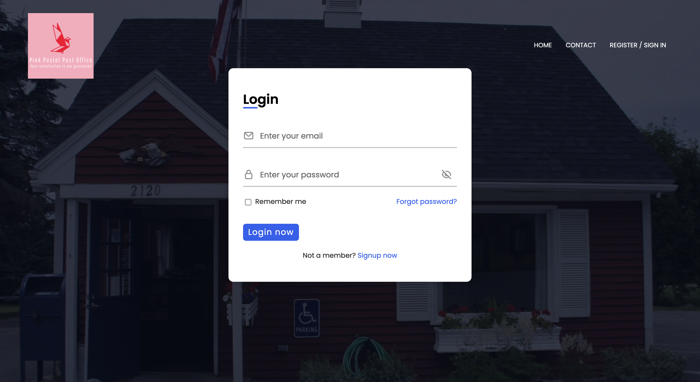
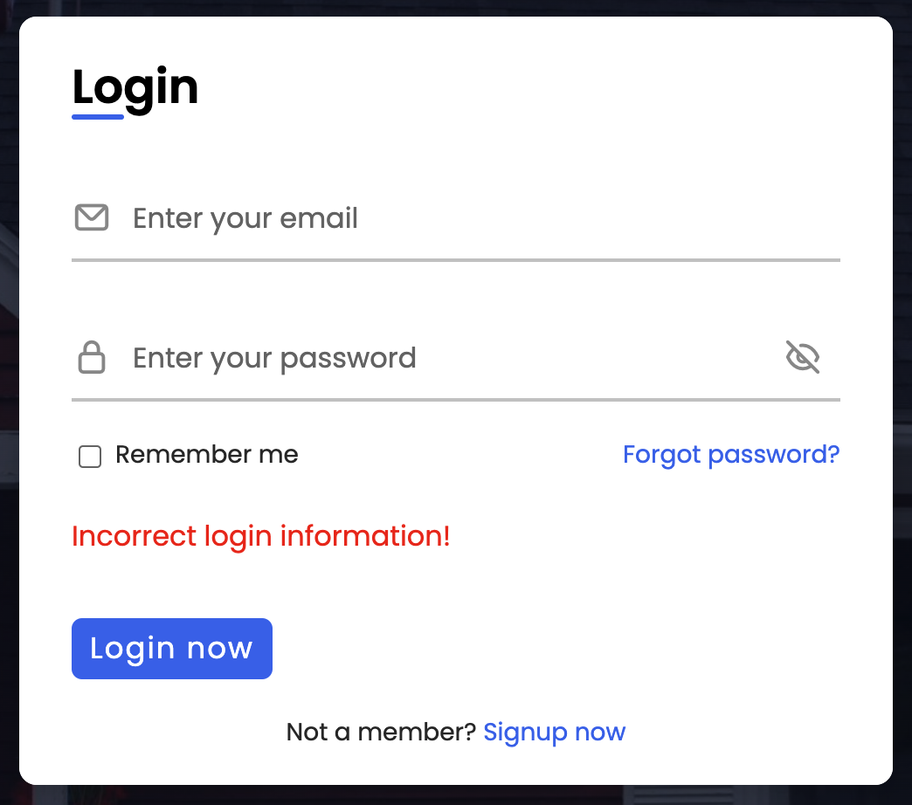
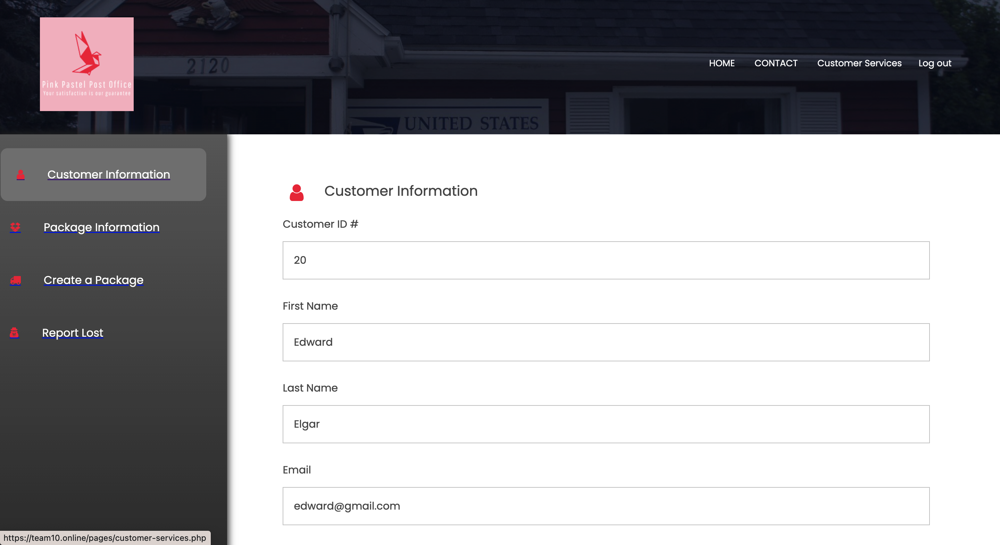
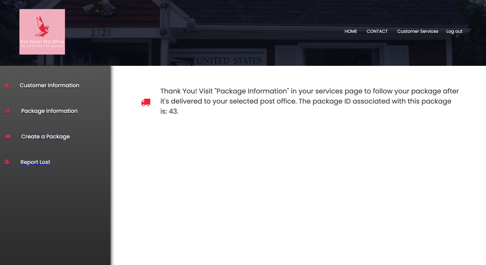
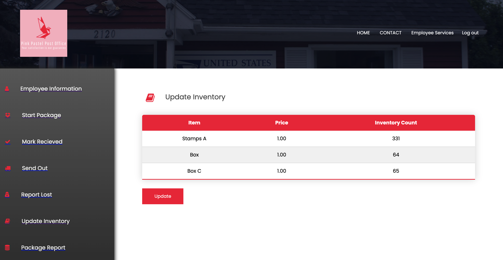

# Pink Pastel Post Office

All members of this repo (Armando, Alexander, Derek, Sevilay, and Zachary) contributed equally to this project.

---

### Table of Contents
- [Description](#description)
- [How To Use](#how-to-use)
- [User Authentication](#user-authentication)
- [Data Entry Forms](#data-entry-forms)
- [Triggers](#triggers)
- [Data Queries](#data-queries)
- [Data Reports](#data-reports)
- [Old Backend Folder](#data-reports)

---

## Description

Our web application was constructed using the following tools and technologies listed below.

#### Tools and Technologies

- HTML
- CSS
- JavaScript
- PHP
- MySQL

[Back To The Top](#pink-pastel-post-office)

---

## How To Use

We recommend you visit our site online, which is hosted at [team10.online](https://team10.online/)

#### Installation
If you wish run this on localhost instead, you will need to install [XAMPP](https://www.apachefriends.org/index.html). Once XAMPP is intalled, you can open it and do the following to get this running:
- Under "General", click "Start" and take note of the IP Address assigned to you.
- Under "Services", click "Start All".
- Under "Network", enable either SSH port option.
- Under "Volumes", click "Mount". This will the IP Address to your Finder (mac) / File Explorer (windows).
- Follow the mounted directory until you see a folder called htdocs. Here you will drop our entire repo.
- Then you can type the IP Address assigned to you into your browser and navigate to the pages folder. For example, 192.168.64.2/COSC3380-PostOffice/root/pages

[Back To The Top](#pink-pastel-post-office)

---

## User Authentication

#### Registration

Once you enter our site, you can click on "REGISTER / SIGN IN" on the top right. You will be prompted to a login screen as shown in the image below. Click on "signup now" and fill out the registration form to create a customer account. For example, I will type in the following information to create an account for a new customer

- First Name: Edward
- Last Name: Elgar
- Email: edward@gmail.com
- Phone Number: 7138853697
- Create a Password: 123
- Confirm a Password: 123
- Building Number: 15
- Street Name: Brentway
- City: Austin
- State: Texas
- Zipcode: 99032

Once you click on "Sign Up" an account will be created for you and you can login. We have also created a test account for you if you'd like to skip registration and login. The login information is
- Email: customer@gmail.com
- Password: 123

Important Notes
- All user passwords are hashed before being stored into the database for privacy reasons. You can see this in our code when a user is created in the functions.inc.php file inside of the includes folder.
- If you do not use the correct login information you will get an error message in red
- When registering for an account, validation is in place to make sure proper characters / numbers are used. If create a password and confirm password do not match, the account will not be created and you will be redirected to fix the information.

Once you are logged in as a customer, you will see a "Customer Services" Link in your navigation bar on the top right. Clicking that will direct you the the customer control panel, which includes all functionality of a customer: viewing / editing their information, viewing package information, creating packages, and reporting packages as lost.

Employee accounts can only be created through an administrator, which we will showcase later, but below are example accounts that you can login to:
- employee@gmail.com
- admin@gmail.com

Both accounts are using the password 123 for simplicity

[Back To The Top](#pink-pastel-post-office)

---

## Data Entry Forms

#### Customer Edit Info & Employee Edit Info
Logging into Edward's account that I created for this example and visiting the Customer Services control panel, we can click on "Customer Information" to view Edward's saved information. Edward can scroll to the bottom to find an "Edit Info" button. This will allow him to edit any of his customer information (except his unique customer ID assigned to him upon account creation). Any updates will get saved in the database and reflected in the customer's information page.

This same functionality also exists in any Employee account. 

#### Customer & Employee Send Package
A customer may send a package under "Create a Package" by filling out a form detailing the destination address, package type, weight, volume, priority shipping, and which post office to send it to. We use the customer's address that they created when registering for an account as the return address should something go wrong in the delivery process. After filling this out, they're prompted with a thank you message and the unique package ID associated with this package request. This package ID also becomes available under their "Package Information" page, which shows which office the package is in transit to, the time arrived, and a history table. 

Employees also have the option of creating a package for a customer by filling out a similar form, but we require the customer's email address. Using the customer's email address we look up their return address and necessary information in the backend. 

Important Notes
- If the customer created a package through their profile at home, the package as marked as "in transit" to the office that they selected. All employees can see packages in transit to their office location and can choose from those to mark them as recieved and automatically update the tracking information in the backend.
- If the employee creates the package for the customer in the office, then the package is marked as "in office" and automatically marked as recieved by the office of the employee who created the package. All packages marked as recieved can then be seen in the employees "Send Out" service, which prompts them to fill out some information on where to send the package to next. We also have triggers in place to keep track of the marked status of a package so that we can keep track of how many packages are in an office at any given point in time for later reports. More details about this will be provided down below.

#### Employee Update Inventory

Under the "Update Inventory" section of an employee's control panel, they are able to view the inventory in their office and click an update button that prompts them to a form to select from their inventory and apply a count increase (or decrease if a negative number is inserted). This change is then reflected when they return to "Update Inentory" and we have a trigger running in the back that inserts a notification into the employee's "Notifications" panel letting them know that an item needs to be restocked once it falls below a certain threshold. 

[Back To The Top](#pink-pastel-post-office)

---

## Triggers

#### Trigger Example 1
Our first trigger involves notifications for new employees.  When a new employee is inserted into the employee table, 
a notification is sent to the admin to confirm and inform them of the employee's successful registration.  After reading,
they may mark notifications as read to make them disappear.

CODE

#### Trigger Example 2

Our second trigger sends a notification when the number of items in stock, such as stamps or envelopes, drops below a
certain level.

CODE

#### Other triggers

We have additional triggers:

-A trigger is used to ensure that an employee cannot be set to their own supervisor.

-Multiple triggers(4) are used to make an Tracking entry whenever a package is entered
into the Tracking_Status table.  Additionally, these triggers ensure that the number 
of packages at a post office is incremented or decremented whenever a package enters
or leaves an office respectively.

[Back To The Top](#pink-pastel-post-office)

[Back To The Top](#pink-pastel-post-office)

---

## Data Queries

#### Data Query Example 1
filler text filler text filler text filler text filler text filler text

[Back To The Top](#pink-pastel-post-office)

---

## Data Reports

#### Data Report Example 1
filler text filler text filler text filler text filler text filler text

[Back To The Top](#pink-pastel-post-office)

## Data Reports

## Old Back End File
This file consists of routes and services that connect to the database and it's fully tested on POSTman to be working. Initially we wanted to create our backend in this direction but we changed strategy to use php instead. 

[Back To The Top](#pink-pastel-post-office)

